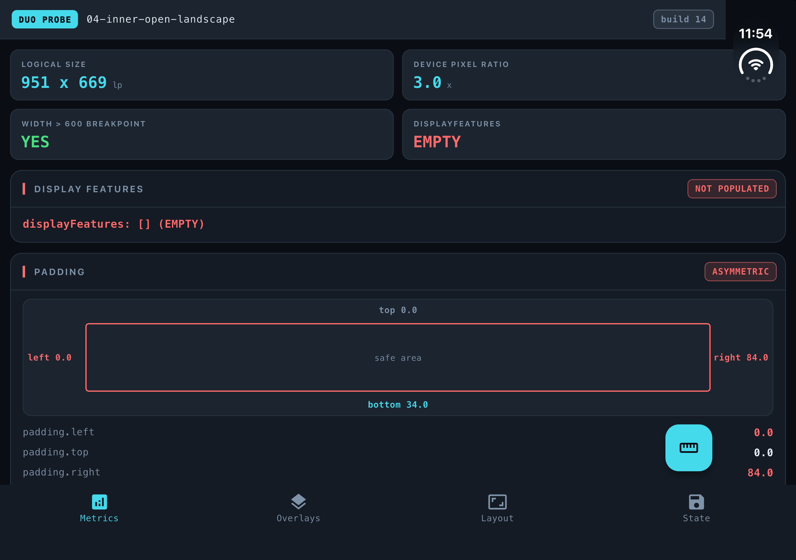
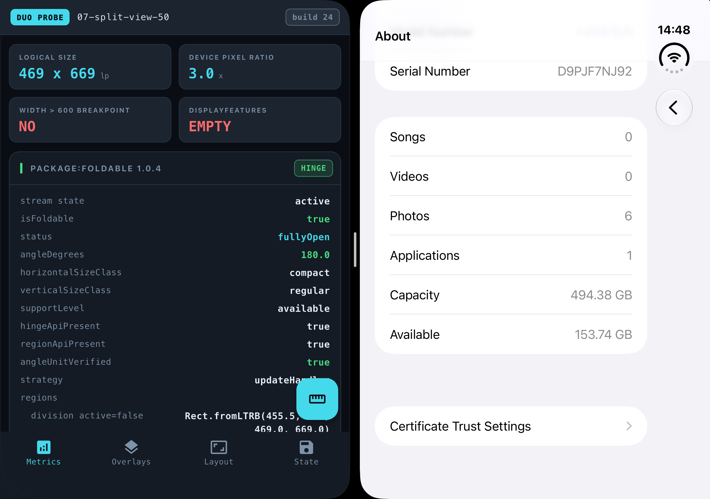
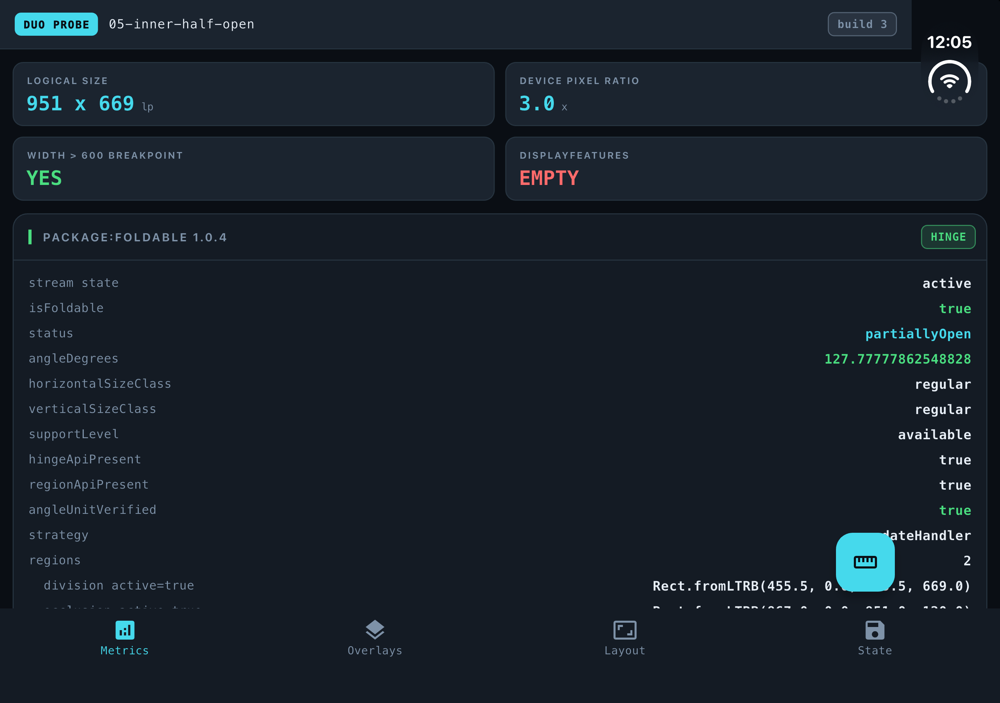
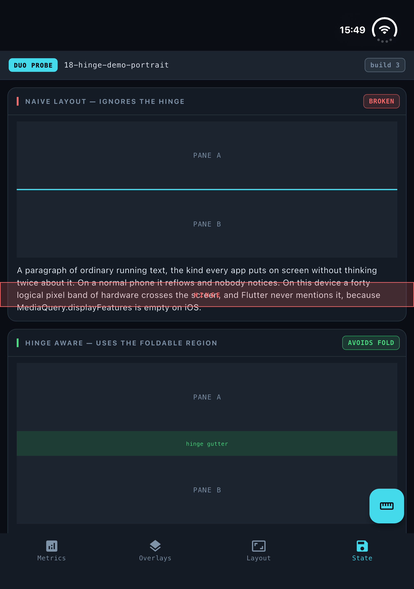
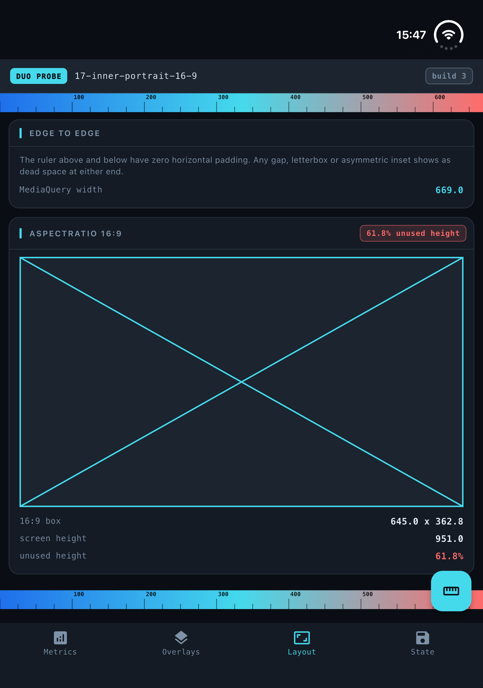

# iPhone Duo and Flutter: what the first foldable iPhone means for your app

*Somnio Software · Flutter engineering · October 2026*

Apple ships the iPhone Duo on October 23. If you have a Flutter app in the
store, it already runs on the device. Nothing to migrate, no new SDK, no build
changes.

That is good news and it is also the catch. Because nothing crashes, nothing
shows up in your crash reporter, and nobody on your team finds out which screens
look wrong until a customer mentions it.

So we went and measured. We built a probe app that reports everything Flutter
knows about the screen it is drawing on, and we put it through twenty-one
situations on the iPhone Duo simulator: both displays, all three postures,
rotated, split beside another app, with the keyboard up. A screenshot and a full
data dump of each.

---

## The short version

- **Your app runs.** No migration. It looks broadly right on both screens.
- **Three habits stop working:** reading the screen size once at startup,
  assuming the left and right margins match, and treating device size as a proxy
  for how much room you have.
- **Flutter cannot see the fold yet on iOS.** Half open and fully open look
  identical to your code.
- **Folding does not lose anything.** No state is wiped, no screen is rebuilt.
- **Start with your forms.** Of the seven iPhone Duo bugs Flutter's own QA team
  filed in September, five involve the keyboard or text fields.
- **Do not build anything hinge-aware yet.** The upstream work is real, but it
  will not be in a stable release before the device ships.
- **Your AI agent will get this wrong, quietly.** The device is newer than its
  training data, and the plausible answer it gives you runs without error and
  does nothing.

---

## What the device is, and whether it is worth your time

A 5.4-inch display on the outside when it is closed. A 7.6-inch display on the
inside when you open it. A hinge down the middle. Announced September 9, on sale
October 23.

The honest framing for anyone deciding where a sprint goes: this is a
first-generation premium device, and it will not be a large share of your users
in year one. Counterpoint Research forecast Apple taking 46% of the North
American foldable market in 2026, which sounds enormous until you remember that
foldables are still a small slice of all phones.

What makes it worth the attention anyway is that the work is not Duo-specific.
Almost everything below also improves your app on iPad, in landscape, in
split-screen and on the web. The Duo is the deadline, not the reason.

Here is what your app actually receives, in logical pixels, the unit Flutter
lays out in:

| Situation | Size your app gets | Safe-area padding |
|---|---|---|
| Closed, portrait | 466 × 678 | right 84, bottom 34 |
| Closed, landscape | 678 × 466 | left 84, bottom 34 |
| Open, portrait | 669 × 951 | top 82, bottom 34 |
| Open, landscape | 951 × 669 | right 84, bottom 34 |
| Half open | 951 × 669 | right 84, bottom 34 |
| Open, beside another app | **469 × 669** | bottom 34 only |



*Our probe app on the inner display. Every value shown on screen is read live
from Flutter, by the app itself.*

Six different layouts, on one device, that a user can move between in seconds.
That is the whole story.

---

## First, the good news

We expected folding to be destructive. It is not.

We took the app through a full cycle, half open to closed to fully open, which
physically moves it from one display to the other and blanks the screen for a
few seconds on the way. Nothing was lost. No screen was recreated, no `initState`
ran a second time, and the page we were watching was still the same instance at
the end. A user filling in a form can fold the phone, show someone a photo, open
it again, and their text is still there.

Split View behaves too. When your app sits visible beside another one and the
user taps the other app, Flutter reports no change at all. The app stays
`resumed`. If you pause video or timers when the app goes inactive, they will not
pause here, which is the behaviour you want.

And rendering is fine. The Flutter team made that point publicly on September 26,
posting a video of Wonderous running on the device with the caption "We just
checked, Flutter still runs everywhere." They are right. The problem is not
drawing pixels.

---

## What actually changes

Three assumptions that most Flutter codebases carry, including good ones, stop
being true at the same time.

### 1. The screen size is no longer something you learn once

**In plain terms:** your app can change size while the user is using it, and it
will not be told.

The device goes from 466 points wide to 951 while running. Anything your code
worked out at startup from the screen size is now wrong, and the usual way to
notice would be a rebuild.

There is no rebuild. We counted. Our root widget built four times at launch and
stayed at four through the entire fold cycle. The size change gets absorbed
further down the tree, below `LayoutBuilder` and `MediaQuery`, so anything
hanging off a top-level `build`, a cached layout decision, a size-based
calculation, an analytics event, never fires.

**What to do:** read sizes inside `build`, from `LayoutBuilder` constraints or
`MediaQuery.sizeOf(context)`. Never in `initState`.

### 2. The margins are not the same on both sides

**In plain terms:** the Duo reserves a wide strip along one edge of the screen,
and which edge it is depends on how you are holding it. A layout that looked
centred ends up pushed to one side.

Look at the table again. There is a large inset on exactly one edge: right when
open in landscape, left when closed in landscape, top when open in portrait, and
nothing at all in Split View.

Which means the common shorthand `EdgeInsets.symmetric(horizontal: 16)` is
correct in two of those six states and wrong in three. The two it survives are
the ones you reach first when you open the simulator, which is exactly how this
reaches production.

It is also not a system toolbar. Reading the reserved regions from the native
API shows a camera cutout, 84 by 120 points when open in landscape. iOS then
reserves the width of that cutout along the entire opposite edge. That amounts
to roughly **44,000 square points** of perfectly good screen that a standard
`SafeArea` will never let you draw on, on the device whose whole selling point
is more screen.

**What to do:** `SafeArea` takes per-edge flags. Turn off the ones you do not
need and reclaim the space.

### 3. A big device no longer means a wide app

**In plain terms:** the user can put a second app next to yours, and yours gets
narrower than a phone.

Open Split View on the unfolded display and your app gets **469 logical
pixels**. That is below almost every tablet breakpoint anyone has written, on the
largest screen Apple has ever put on an iPhone. Flutter also reports the
orientation as portrait at that moment, because the pane is taller than it is
wide.



*Split View on the Duo is fifty-fifty only. There is no one-third option, and
dragging the divider past the middle closes your app.*

This is also the only situation we measured where the left and right padding
match. So an app that finally got the asymmetric margin right will watch that
asymmetry vanish and come back as the user moves in and out of Split View,
seconds apart, on the same screen.

**What to do:** add 469 × 669 to whatever set of sizes you test layouts against.
It is worth having regardless of the Duo, as a cheap stand-in for a narrow pane
on a big display.

### The three of them together

All three fixes fit in one `build` method, and none of them are Duo-specific:

```dart
@override
Widget build(BuildContext context) {
  // 1. Size is read here, not in initState. The Duo resizes mid-session and
  //    the top of the tree never rebuilds.
  return LayoutBuilder(
    builder: (context, constraints) {
      // 2. Decide on available width, not on device size. Split View on the
      //    inner display hands you 469 logical pixels.
      final useWideLayout = constraints.maxWidth >= 600;

      // 3. The reserved inset sits on one edge only, and which edge depends on
      //    posture. Read it rather than assuming it is symmetric.
      final inset = MediaQuery.paddingOf(context);

      return Padding(
        padding: EdgeInsets.only(
          left: inset.left > 16 ? inset.left : 16,
          right: inset.right > 16 ? inset.right : 16,
        ),
        child: useWideLayout ? const TwoPaneView() : const SinglePaneView(),
      );
    },
  );
}
```

---

## The thing Flutter cannot do yet

**In plain terms:** Flutter has no way to know the phone is folded.

This part is documented rather than discovered, and it is the single most
important thing to understand before anyone plans work.

Flutter has supported foldables for years. `MediaQuery.displayFeatures` reports
hinges, folds and cutouts, and the framework uses it internally to keep dialogs
off a hinge. The
[official documentation](https://api.flutter.dev/flutter/dart-ui/DisplayFeature-class.html)
states the limitation in one line:

> "This is populated only on Android."

The implementation lives in Flutter's Android layer. The iOS side has no
equivalent. In all twenty-one situations we measured, on both displays, in every
posture, the list came back empty.

The information does exist. In the same frame where Flutter reported nothing,
the [`foldable`](https://pub.dev/packages/foldable) package reported the device
as partially open at 127.8 degrees, with the fold as a 40-point band down the
middle of the screen and the camera cutout as a second rectangle.



*Same device, same moment. iOS knows the hinge angle to eight decimal places and
publishes it. It reaches UIKit. It does not reach Flutter.*

Two consequences follow, and both matter.

**Half open is invisible.** Propped on a table at 128 degrees, your app sees
exactly the same size and padding as fully flat. Nothing in layout and nothing
in the app lifecycle tells the two apart.

**Folding sends no signal.** The app crosses between two physical displays, with
the screen black for several seconds, and receives zero lifecycle events.
`didChangeMetrics` fires and the size changes, so your code can tell that
something happened. Nothing tells it what.

That has a visible cost. The fold sits dead centre and rotates with the device,
vertical in landscape, horizontal in portrait. A two-pane layout that splits
down the middle puts its divider exactly on the hinge. So does a centred button,
a centred logo, or a line of body text.



*Top: an ordinary two-pane layout. The red band is where the hinge actually is,
cutting through two lines of text. Bottom: the same layout reserving a gutter the
width of the fold. The only difference between them is reading the fold rectangle
from a package instead of from Flutter.*

---

## What Apple is asking for, and how far Flutter can follow

This is the part most coverage skips, and it is where the gap is widest.

Apple's guidance for the Duo, across its
[Tech Talks](https://developer.apple.com/videos/play/tech-talks/111463/), is not
"handle a bigger screen". It asks for three specific things.

**Design for size classes, not for poses.** Compact width on the outer display,
regular width on the inner one, and no logic keyed to a specific device state.
Flutter handles this well today. It is a code-review habit, not a framework gap.

**Move controls to the side edges.** The inner display is wide and squat, so
Apple wants toolbars and tab bars running down the edge rather than across the
bottom, to preserve vertical space and keep actions in reach. Flutter has no
equivalent today. Material's navigation rail is the closest thing, and it is not
the same pattern. There are open requests to make Flutter's navigation chrome
move to the sidebar automatically based on fold state, and none of them have
landed.

**Use displacement when the device is half folded.** Apple's recommendation is to
shift interactive elements into the lower half when the phone is propped open, so
they are reachable while the device sits on a table. Flutter cannot do this at
all right now, for the reason in the previous section. It does not know the phone
is half folded.

So: one of the three is a matter of discipline, and two of the three are blocked
on Flutter itself. That is a useful thing to be able to tell a stakeholder who
has watched the Apple video and is asking why the app does not look like that.

---

## What broke when we went looking

Four findings, in the order we would prioritise them.

### Your forms are the highest risk

With the keyboard open, Flutter reported the keyboard taking 264 points of the
screen. We changed the posture without closing it. The next reading was 0.26.
The keyboard had closed itself.

That matches [a known issue](https://github.com/flutter/flutter/issues/193096),
and it is not an isolated one. Between September 21 and 23, Flutter's own QA
team filed seven iPhone Duo bugs, and **five of them involve text input**: the
keyboard not coming back, the emoji keyboard not restoring, the text cursor
disappearing, autocomplete suggestions vanishing, and a crash during a keyboard
layout transition.

If you only have one afternoon, this is where to spend it. Open a form, type
something, fold the phone, open it again.

### A locked orientation stops being a guarantee

Plenty of screens lock themselves to portrait or landscape. Video players,
camera flows and games do it routinely.

Closed, at 466 × 678, asking for landscape worked and the app turned to
678 × 466. Fully open at 951 × 669, asking for portrait did nothing at all. iOS
explained why:

```
Failed to change device orientation: Error Domain=UISceneErrorDomain Code=101
"The current windowing mode does not allow for programmatic changes to
interface orientation."
```

Note what it blames. Not the display, but the current windowing mode. We did not
isolate which of the two is the real cause, so take this as the behaviour we
measured rather than a settled explanation. Either way, the practical advice is
the same. If a screen locks its orientation, it needs to look right without the
lock.

### Dialogs and sheets ignore the room you give them

On the inner display in landscape, with 951 points available, an `AlertDialog`
holding a deliberately enormous child painted at 787 points. A date picker
painted at 496. A bottom sheet at 640.

The date picker is the one to look at. It uses 52% of the available width on the
inner display and 75% on the much smaller outer one. It gets proportionally
narrower as the screen gets bigger, which is the opposite of what anyone wants.

### Video letterboxes badly

A 16:9 box across the available width leaves 22% of the height empty on the
inner display in landscape, and **62%** in portrait. The inner screen is close to
square, far squarer than a phone held sideways.



*Treat 16:9 as one option rather than the default on media screens, and give the
player a way to fill the space.*

---

## What did not break

Negative results are worth publishing, because they save someone a day.

**Navigation bars are fine.** A reported issue says tab bar width gets truncated
when folded. Flutter has four widgets that could reasonably be called a tab bar,
so we measured all four on both displays. Eight measurements, every one filling
the width it was given, exactly.

**The App Switcher preview is fine.** Another issue says the preview renders
distorted after a device mode change. Ours rendered correctly after crossing all
three postures.

Neither result closes those issues, since a negative in one setup says little
about the reporter's. But if you were about to budget time for either, it may
not be where your problem is.

**The black screen during folding is not yours to fix.** The screen does go dark
for a few seconds. Flutter's position is on record: the issue was closed in
September with "Likely a bug on iOS and let's see if they fix it in beta, but
nothing we can do here."

---

## The packages, and what is coming

[`foldable`](https://pub.dev/packages/foldable) bridges the gap. It reports
hinge angle, posture and the fold and camera regions, works in the simulator
with no hardware, and its author also wrote the upstream fix. We used it for
every fold measurement here.

We would not call it verified, and want to be precise about why. It agreed with
Flutter's own padding values in every state we checked. It also gave us two
readings calling the device closed while reporting a non-zero angle, and three
where it said there was no foldable at all. Without physical hardware there is
nothing to check it against.

[`dual_screen`](https://pub.dev/packages/dual_screen), which used to provide the
`TwoPane` widget, is Android-only and unchanged since 2023. It does not help.

As for Flutter itself: the proposal to report display features on iOS was filed
the day Apple announced the device. A pull request implementing it is open, out
of draft, with a reviewer assigned, and not merged. A second one, animating
content between sub-screens as the fold changes, is in the same state. And
reporting the fold is only half of it; a separate request asks for the framework
to be notified when those regions move, which is what an app would need in order
to react.

Flutter stable is 3.47.5, with nothing foldable-specific in it. The device ships
in three weeks. Watch that work, but do not plan around it.

---

## What to do before October 23

**This week, no simulator needed.**

1. Search the codebase for `MediaQuery` reads inside `initState`. Move them into
   `build`.
2. Search for `EdgeInsets.symmetric(horizontal:`. Each one is a place the Duo
   will push your content off centre.
3. Search for `setPreferredOrientations`. Every screen that locks orientation
   needs to survive without the lock.
4. Add 469 × 669 to your layout test sizes.

**One afternoon with the simulator.**

5. Open a form, type into it, fold the device, open it again. This is the single
   highest-value test on the list.
6. Fold, unfold and rotate while watching for layouts that assume a fixed size.
7. Open a dialog, a date picker and a bottom sheet on the inner display and look
   at how much of the screen they use.
8. Check any screen that shows video or media at a fixed aspect ratio.

**Not yet.**

9. Do not build a hinge-aware layout. There is no supported way to read the fold,
   and the package route means shipping a dependency for a feature your users
   cannot rely on.

One practical warning before anyone blocks out that afternoon. The iPhone Duo
needs the iOS 27.1 simulator runtime specifically, and creating the device
against 27.0 fails outright. That runtime currently ships with Xcode 27.1,
which is still in beta, and it cannot be downloaded from the command line, so
it has to come through the Xcode interface. Budget setup time.

And one thing worth telling your QA lead: **this cannot be automated today.**
There is no command-line control for the hinge anywhere in Apple's simulator
tooling. Launching the app, taking screenshots and reading metrics all automate
normally, but the fold itself has to be done by hand, by a person, clicking a
button. Foldable behaviour cannot be a regression test. That is a reason to do
the manual pass deliberately rather than assuming CI will catch it later.

---

## If you are going to hand this to an AI agent

Most teams will. So it is worth being specific about where an agent helps here
and where it fails, because on this device failure does not look like an error.

**It will write hinge code that does nothing.** Apple announced the Duo on
September 9. Any model trained before that answers from the foldables in its
training data, which are all Android. So it reaches for
`MediaQuery.displayFeatures`, builds a correct layout around it, and hands you
code that compiles, runs, passes review and has no effect, because that list is
empty on iOS. No exception, no console warning, no failing test. The code is
idiomatic and the API is real. The one sentence that invalidates it, *"This is
populated only on Android"*, is a line in the class reference the agent had no
reason to open. Try it once on your own codebase to see how convincing it looks.

**It will suggest the wrong package.** `dual_screen` has years of tutorials
behind it, and is Android-only. `foldable` is five days old, so it cannot be in
any current model's weights; an agent that names it is guessing. Treat a guessed
package name as a security question rather than a correctness one, because
attackers register plausible names that models hallucinate. A person opens
pub.dev before anything reaches a `pubspec.yaml`.

**What it got wrong here.** We used an agent throughout this lab, and its
mistake is more useful than its output. The first pass at the orientation
finding wrote *"No error, no exception, no signal of any kind."* False:
`UISceneErrorDomain Code=101` was in the log ten times. The same pass said the
call works on the outer display; all twelve logged calls were made on the inner
one, and the outer log was gone because an early version of the harness wrote
with `tee` instead of `tee -a`.

Two failures worth separating. It read absence of evidence as evidence of
absence, because nothing in its own summary said "error", so it wrote "no
error", and the grep that settles it takes two seconds. And it trusted a harness
it had written itself: a log that truncates silently produces a dataset that
looks complete, and the missing data left no hole in the shape of a hole. We
caught both by re-running the test a week later. The fix was not a better
prompt. It was a second measurement.

**The fold cannot be delegated.** There is no `simctl` verb for posture: the
only way to fold the device is three buttons in a DeviceHub window, clicked by a
person. Everything else automated cleanly. We did try driving the GUI with
AppleScript, and it works, and it is hostile, taking over the keyboard and
pointer of whoever is sitting at the machine. So the highest-value test here
needs a human hand and human eyes. An agent cannot type into a form on a folding
phone, and it cannot fold the phone.

**How to ask.** Paste the measurements table above rather than asking for the
numbers; it replaces what the model would otherwise invent. Ask for searches,
not architecture: "find every `MediaQuery` read inside `initState`, with file
and line" is work an agent does better than a person, while "make the app adapt
to the fold" is work it fails at confidently. Require a file and line for every
claim. Put one line in your `CLAUDE.md` or `AGENTS.md` saying what it cannot
know, that the Duo shipped after its cutoff, that `displayFeatures` is empty on
iOS, and not to propose `dual_screen`. And say explicitly that "I could not
verify this" is an acceptable answer, because a model not given permission to be
uncertain will resolve uncertainty by producing confident prose, which is
exactly how that orientation sentence got written.

The Dart and Flutter teams now ship official agent skills, installed with
`npx skills add flutter/agent-plugins --skill '*' --agent universal --yes`. Two
of the ten are relevant here, one for responsive layouts and one for fixing
layout issues. None covers foldables, which is this article's gap one layer up.

---

## For the people deciding

**Risk is moderate, not severe.** Nothing crashes. The failure mode is screens
that look wrong, forms that lose focus and video with large black bars. A
quality problem, not an outage.

**The effort is small and mostly reusable.** The four searches above are a day
of work for one engineer, and everything they fix also improves the app on
iPad, in landscape and in split-screen, on hardware you already support.

**The fold itself is not actionable yet.** Anything that genuinely responds to
the hinge is blocked on Flutter, not on your team. If a stakeholder has seen
Apple's demo and wants that, the honest answer is upstream work in progress
with no release date.

**The deadline is real but soft.** October 23 is when the first users can
install your app on the device. It is not when it stops working.

---

## How we measured this

We built a probe app that renders and logs everything Flutter reports about its
environment: size, pixel ratio, padding, insets, display features, orientation,
text scale, brightness, rebuild counts and lifecycle events. We drove it through
twenty-one situations and captured a screenshot of both displays and a full data
dump for each. Two sessions on one machine, a week apart, on Xcode 27.1 beta,
the iOS 27.1 simulator runtime and Flutter 3.47.5 stable.

**What is solid and what is not.** Values that repeated across dozens of
captures, like the 84-point inset and the empty display features, are reliable.
The portrait date picker was measured once. The orientation finding rests on a
single pair of requests per display. The black screen during a fold is something
we watched, not something we timed, and we are not going to put a number on it.
This is beta software measured a month before the hardware ships, so a real
device may differ, and we will run the whole set again after launch.

The lab is public. The probe app, the harness, the twenty-one screenshots and
the raw logs are all at
[github.com/rcjuancarlosuwu/duo-lab](https://github.com/rcjuancarlosuwu/duo-lab),
for anyone who wants to reproduce it or check a number.

---

## Where this leaves you

The assumptions this device breaks were never really safe: one screen size known
at startup, margins that match on both sides, device size standing in for
available room. The Duo just removes the last configuration where they happened
to hold, and fixing them pays for itself on hardware you already support.

Two things are specific to it and belong in planning. Orientation locking did
not hold in the state we measured on the inner display. And Flutter cannot tell
you the phone is folded, in layout or in lifecycle, so anything depending on the
hinge has to wait. October 23 is a good reason to finally schedule the rest.

---

**We build and audit Flutter apps at Somnio Software.** If you want a second pair
of eyes on what the Duo means for an app you already ship, from the team that
measured it, [get in touch](https://somniosoftware.com/contact).
